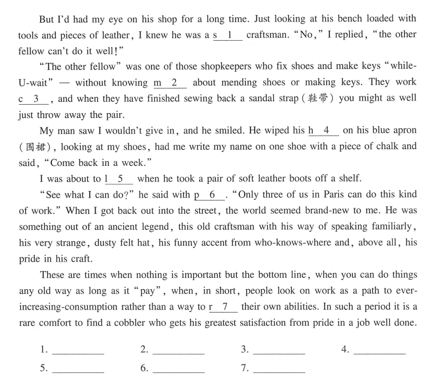

# 10.30


``` text
A. settle  B. presencee  C. commerciale  D. treat  E. convince  F. remarkable
G. honor  H. diagnose  I. search  J. characterized  K. undergo
```

1. The prizes are intended to celebrate the unusual, _________ the imaginative and arouse people’s interest in science, medicine and technology.
2. What distinguishes this company from others is that they insist that _________ considerations must come second to
conservation of the environment.
3. It was said that honey was once used by German doctors to _________ battle wounds.
4. It is a _________ discovery, no doubt, but it doesn’t represent a dramatic shift in how we understand the universe.
5. We still have to _________ the employers that this is of financial benefits for them; and of course the workers, too,
that it is of health benefits for them.
6. Donna did not dare to _________ herself too comfortably into her seat, in case she fell asleep.
7. In the film, many people returned to rural areas in a desperate _________ for food after the war.
8. The test is used to _________ a variety of diseases, especially those are highly infectious.
9. In fact, teachers or instructors should be required to _________ mid-career training and development.
10. It is found that women tend to have networks _________ by close relationships and a great deal of redundancy.


<div
    align="center"
    style="
    font-family : Consolas;
    color : #ff0000
    ">
1~5: GCDFE 6~10: AIHKJ
</div>

---


commercialed `商业化的`
diagnosis

---

[]()|[]()|[]()|[]()|[]()
:-:|:-:|:-:|:-:|:-:
in honor of|in search of|be characterized by|in the presence of|treat sb. to
be diagnosed with|convince sb. of|settle down to

1. During a banquet _________ his visit, Reagan spoke of the need for“mutual respect and benefit” between China
and the United States.
2. After talking about the past holiday, they finally _________ a discussion of the main issues.
3. When she got her salary, she _________ a new dress as well as a candle-lit dinner.
4. Although I soon _________ my innocence, I thought he still had serious doubts about my sanity.
5. The boy promised to his father that he would not complain _________ his classmates.
6. Dark as it was, Mr. Smith went out _________ a doctor for his sick wife.
7. Not only are typical constitutional processes rather exclusionary and elitist, but they also tend to _________ an utter lack of transparency.
8. The former president of the construction company retired after _________ a rare cancer.


---


<div
    align="center"
    style="
    font-family : Consolas;
    color : #ff0000
    ">
1.chance 2. 3. 4. 5.distance 6. 7.between
</div>

---



---

