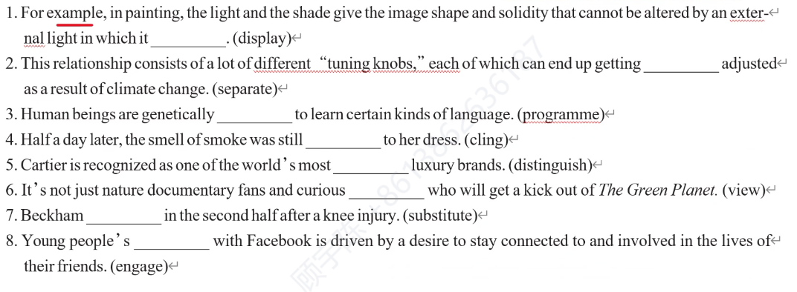

#### From street food to museums, Chinese food hot in US
From baozi in Boston to jianbing in New York, traditional Chinese street food are popping up in the US. Meizhou Dongpo opened its first US restaurant in Beverly Hills, California, in 2013, with offerings from its menu in China. Locally h ________	chefs were sent to China for training. Next spring, Beijing's Dadong, known for its Peking Duck, will open a flagship US restaurant in Manhattan.  
Xi'an's Famous Foods is about to have its 12th location in New York near the Museum of Modem Art. Its original location, e ________	in 2005, was the first restaurant to bring Xi'an cuisine to the US.
Chinese food is also the stuff of museum exhibits. A cunent exhibition at the Museum of Chinese in America in New York called Sour, Sweet, Bitter, Spicy: Stories of Chinese Food and l ______________	in America raises the food to an art form, literally.  
On a r ________	October afternoon, people stood on line for the offerings of Hangzhou-based Gan Qi Shi's first overseas baozi shop, in Harvard Square in Cambridge, Massachusetts. The US chain adopted the English name of Tom's BaoBao. "I used to grab burgers and Korean tofu soup w ________	I needed a quick bite," said Wang Na, a Chinese grad student at Harvard. "Now I get two baozi. They are h ________	, and taste like home.  
In New York, Mr. Bing, a food stand serving Beijing jianbing, was named "Rookie of the Year" at the 2016 Vendy Awards, which recognizes the city's best food carts. Mr. Bing is Brian Goldberg, a New York native who, a ________	a student in 1998 in Beijing, settled on his favorite among 40 different jianbin and p ________	the recipe from a street vendor （小贩）.He then flew the vendor to Hong Kong, where the first Mr. Bing booth opened in 2012, so the master could teach his e ________	how to make the real deal.  
M_______, a growing number of bubble tea shops can be found in the US, helping diners to wash down the tasty food from China.  

---

